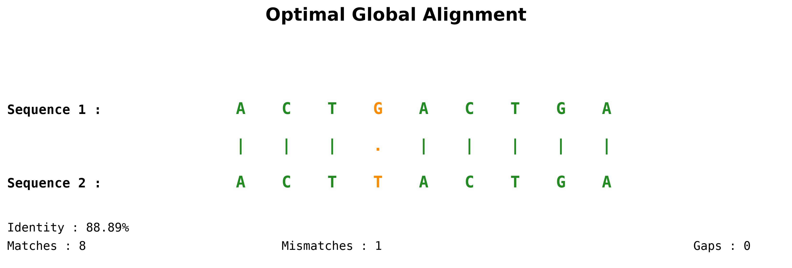
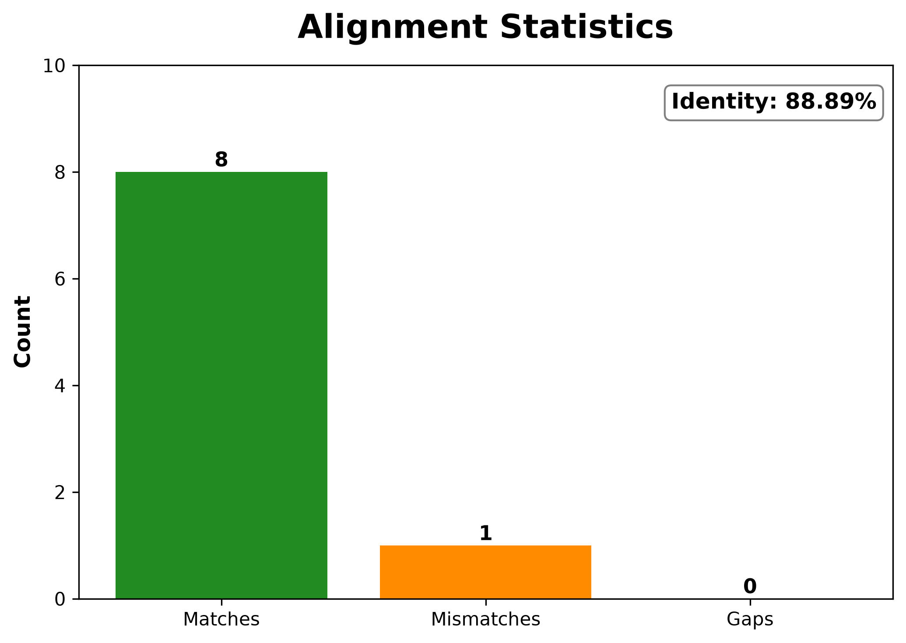
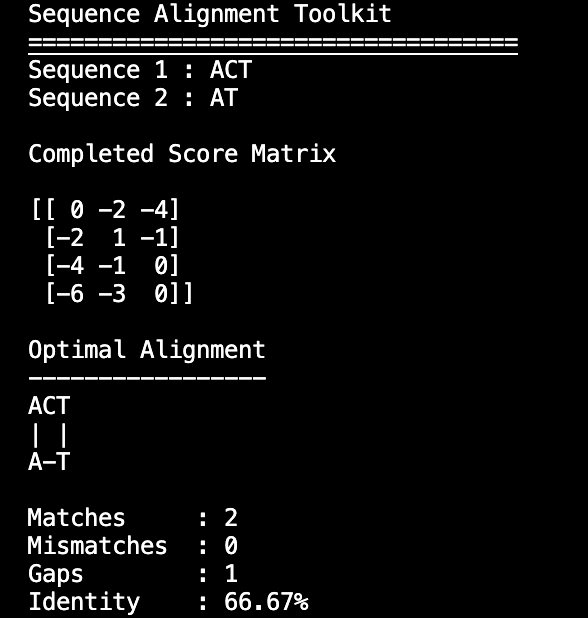
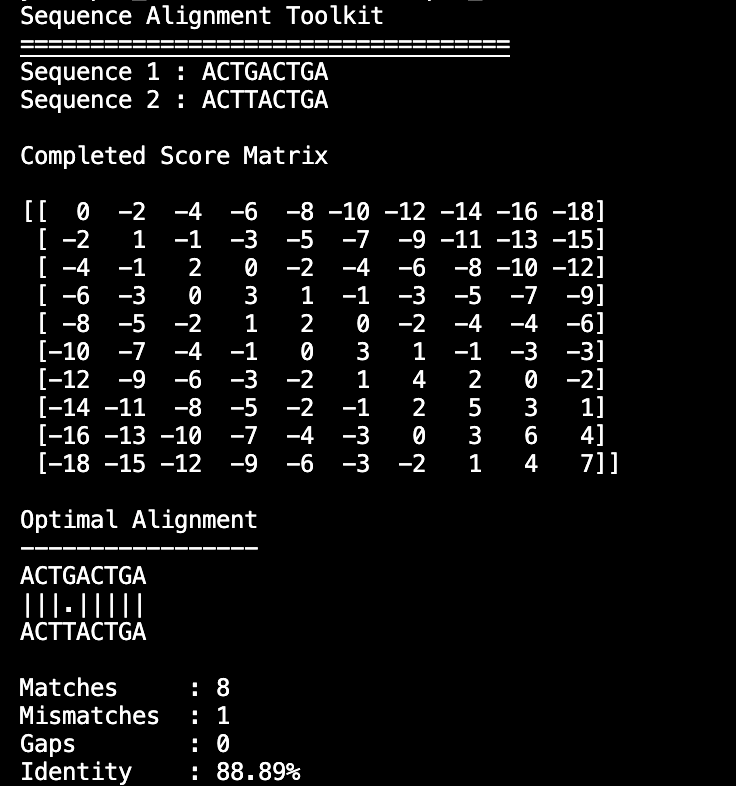
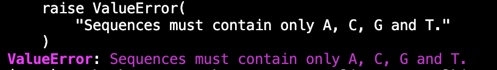

# 🧬 Sequence Alignment Toolkit

# 🧬 Sequence Alignment Toolkit


A Python-based bioinformatics toolkit implementing the **Needleman–Wunsch global sequence alignment algorithm** from scratch using dynamic programming.

The toolkit supports direct DNA sequence input, FASTA files, publication-quality visualizations, and alignment statistics. It is designed as an educational and practical implementation of one of the fundamental algorithms in computational biology.

---

## ✨ Features

- ✅ Needleman–Wunsch Global Sequence Alignment
- ✅ Dynamic Programming Score Matrix
- ✅ Traceback Path Reconstruction
- ✅ FASTA File Support
- ✅ DNA Sequence Validation
- ✅ Alignment Statistics
- ✅ Publication-quality Visualizations
- ✅ PNG and SVG Figure Export
- ✅ Command Line Interface (CLI)

---

# 📂 Project Structure

```text
Sequence-Alignment-Toolkit/

├── align.py
├── algorithms.py
├── formatter.py
├── io_utils.py
├── scoring.py
├── visualization.py
├── requirements.txt
├── README.md
├── LICENSE
│
├── sample_data/
│   ├── human.fasta
│   └── mouse.fasta
│
├── output/
│
├── screenshots/
│   ├── traceback_overlay.png
│   ├── alignment_visualization.png
│   └── alignment_statistics.png
│
└── tests/
```

---

# ⚙️ Installation

Clone the repository

```bash
git clone https://github.com/HareemAhmad-Molbio/Sequence-Alignment-Toolkit.git

cd Sequence-Alignment-Toolkit
```

Create a virtual environment

```bash
python3 -m venv venv
```

Activate it

### macOS / Linux

```bash
source venv/bin/activate
```

### Windows

```bash
venv\Scripts\activate
```

Install dependencies

```bash
pip install -r requirements.txt
```

---

# 🚀 Usage

## Align two DNA sequences

```bash
python align.py ACTGACTGA ACTTACTGA
```

---

## Align FASTA sequences

```bash
python align.py sample_data/human.fasta sample_data/mouse.fasta
```

---

# 📊 Workflow

The toolkit performs the following steps:

```text
Input Sequences
        │
        ▼
Initialize Dynamic Programming Matrix
        │
        ▼
Fill Score Matrix
        │
        ▼
Traceback Reconstruction
        │
        ▼
Generate Optimal Alignment
        │
        ▼
Compute Alignment Statistics
        │
        ▼
Generate Publication-quality Figures
```

---

# 📈 Visualization

## Dynamic Programming Matrix with Traceback

The toolkit generates a heatmap of the Needleman–Wunsch score matrix and overlays the optimal traceback path.


---

## Optimal Sequence Alignment

Publication-style visualization of the final global alignment.



---

## Alignment Statistics

Summary of matches, mismatches, gaps and percentage identity.



---

## Screenshots

### Global Sequence Alignment



---

### FASTA File Alignment



---

### Invalid DNA Validation



# 📋 Example Output

```text
Sequence Alignment Toolkit

Sequence 1 : ACTGACTGA
Sequence 2 : ACTTACTGA

Optimal Alignment

ACTGACTGA
|||.|||||
ACTTACTGA

Matches     : 8
Mismatches  : 1
Gaps        : 0
Identity    : 88.89%
```

---

# 📄 Generated Output

The toolkit automatically exports publication-quality figures.

```text
output/

score_matrix_heatmap.png
score_matrix_heatmap.svg

alignment_visualization.png
alignment_visualization.svg

alignment_statistics.png
alignment_statistics.svg
```

---

# 🧬 Algorithm

This project implements the classical **Needleman–Wunsch Global Alignment Algorithm**.

The implementation consists of:

- Matrix Initialization
- Dynamic Programming Matrix Filling
- Traceback Reconstruction
- Optimal Global Alignment
- Alignment Statistics
- Visualization Module

---

# 🛠 Technologies

- Python 3
- NumPy
- Matplotlib

---

# 🎯 Future Improvements

- Smith–Waterman Local Alignment
- Affine Gap Penalties
- Protein Sequence Alignment
- Custom Scoring Matrices (BLOSUM/PAM)
- Multiple Sequence Alignment
- Interactive Visualization
- GUI Version
- Performance Optimization

---

# 📚 References

Needleman SB, Wunsch CD.

*A general method applicable to the search for similarities in the amino acid sequence of two proteins.*

Journal of Molecular Biology (1970)

https://doi.org/10.1016/0022-2836(70)90057-4

---

# 📜 License

This project is licensed under the MIT License.

---

# 👨‍💻 Author

**Hareem Ahmad**

M.Sc. Molecular Biology & Biochemistry

Bioinformatics | Computational Biology | AI for Life Sciences

GitHub:

https://github.com/HareemAhmad-Molbio