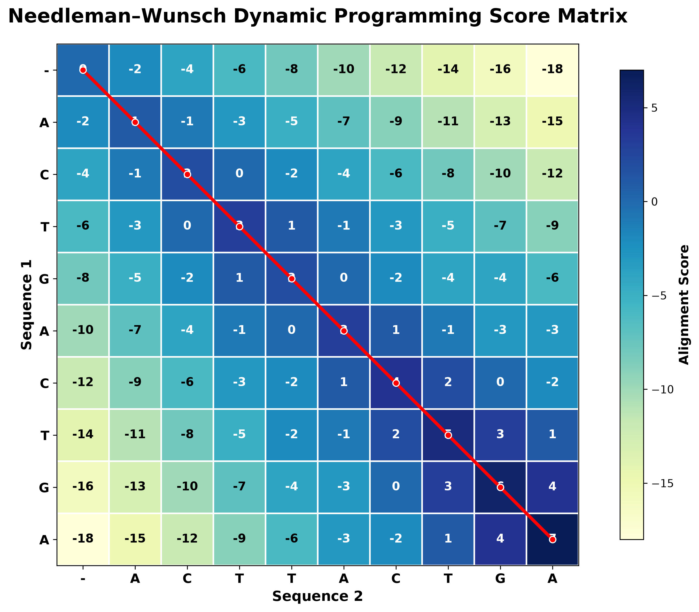

# 🧬 Sequence Alignment Toolkit


> **A research-oriented Python toolkit implementing the classical Needleman–Wunsch global sequence alignment algorithm from scratch with scientific visualizations for molecular biology and bioinformatics.**

---

## 📖 Overview

Sequence alignment is one of the fundamental techniques in **molecular biology**, **genomics**, **evolutionary biology**, and **bioinformatics**. By comparing DNA, RNA, or protein sequences, researchers can identify mutations, detect conserved regions, infer evolutionary relationships, and investigate gene function.

This project implements the **Needleman–Wunsch Global Sequence Alignment Algorithm**, one of the most influential algorithms in computational biology, entirely from scratch in Python using **dynamic programming**.

Unlike implementations that rely on existing alignment libraries, this project focuses on understanding every computational step of the algorithm, from matrix initialization to traceback reconstruction and scientific visualization.

The toolkit combines biological relevance with clean software engineering practices, making it suitable for learning, teaching, and portfolio demonstration.

---

# 🔬 Biological Applications

This toolkit demonstrates concepts used throughout modern molecular biology and bioinformatics, including:

- Comparative genomics
- DNA sequence comparison
- Mutation analysis
- Gene similarity studies
- Evolutionary biology
- Molecular evolution
- Sequence homology analysis
- Bioinformatics education
- Algorithm visualization
- Computational biology training

---

# 🧠 Algorithm Background

The Needleman–Wunsch algorithm was introduced in **1970** and remains one of the foundational algorithms in computational biology.

It uses **dynamic programming** to determine the optimal global alignment between two biological sequences by:

1. Initializing a scoring matrix
2. Filling the matrix using recurrence relations
3. Reconstructing the optimal alignment through traceback

Although modern alignment tools employ more sophisticated heuristics and scoring systems, Needleman–Wunsch remains essential for understanding sequence alignment algorithms and forms the basis for many advanced computational methods.

---

# 🎯 Project Objectives

The primary goals of this project are:

- Understand sequence alignment from first principles
- Implement the complete algorithm without external alignment libraries
- Produce publication-quality visualizations
- Demonstrate modular scientific software development
- Provide an educational resource for students learning bioinformatics

---

# ✨ Features

- ✅ Needleman–Wunsch Global Sequence Alignment
- ✅ Dynamic Programming Matrix
- ✅ Traceback Reconstruction
- ✅ FASTA File Support
- ✅ DNA Sequence Validation
- ✅ Alignment Statistics
- ✅ Publication-quality Visualizations
- ✅ PNG Figure Export
- ✅ SVG Figure Export
- ✅ Command Line Interface (CLI)

---

# 📂 Project Structure

```text
Sequence-Alignment-Toolkit/

├── align.py
├── algorithms.py
├── formatter.py
├── io_utils.py
├── scoring.py
├── visualization.py
├── requirements.txt
├── README.md
├── LICENSE
│
├── sample_data/
│   ├── human.fasta
│   └── mouse.fasta
│
├── output/
│
├── screenshots/
│   ├── score_matrix_heatmap.png
│   ├── alignment_visualization.png
│   └── alignment_statistics.png
│
└── tests/
```

---

# ⚙️ Installation

Clone the repository

```bash
git clone https://github.com/HareemAhmad-Molbio/Sequence-Alignment-Toolkit.git

cd Sequence-Alignment-Toolkit
```

Create a virtual environment

```bash
python3 -m venv venv
```

Activate the environment

### macOS / Linux

```bash
source venv/bin/activate
```

### Windows

```bash
venv\Scripts\activate
```

Install dependencies

```bash
pip install -r requirements.txt
```

---

# 🚀 Usage

## Align two DNA sequences

```bash
python align.py ACTGACTGA ACTTACTGA
```

---

## Align FASTA files

```bash
python align.py sample_data/human.fasta sample_data/mouse.fasta
```

---

# ⚙️ Computational Workflow

```text
Input DNA Sequences
        │
        ▼
Sequence Validation
        │
        ▼
Initialize Dynamic Programming Matrix
        │
        ▼
Matrix Filling
        │
        ▼
Traceback Reconstruction
        │
        ▼
Optimal Global Alignment
        │
        ▼
Alignment Statistics
        │
        ▼
Scientific Visualization
```

---

# 📊 Visualization

## Dynamic Programming Matrix with Traceback

The toolkit generates a heatmap of the dynamic programming matrix with the optimal traceback path overlaid, allowing users to visualize how the global alignment is reconstructed.



---

## Publication-style Sequence Alignment

The optimal alignment is exported as a publication-quality figure highlighting sequence similarity.


---

## Alignment Statistics

Summary statistics including matches, mismatches, gaps, and sequence identity are automatically visualized.


---

# 📋 Example Output

```text
Sequence Alignment Toolkit

Sequence 1 : ACTGACTGA
Sequence 2 : ACTTACTGA

Optimal Alignment

ACTGACTGA
|||.|||||
ACTTACTGA

Matches      : 8
Mismatches   : 1
Gaps         : 0
Identity     : 88.89%
```

---

# 📁 Generated Output

The toolkit automatically exports high-resolution scientific figures.

```text
output/

score_matrix_heatmap.png
score_matrix_heatmap.svg

alignment_visualization.png
alignment_visualization.svg

alignment_statistics.png
alignment_statistics.svg
```

---

# 🛠️ Software Design

The project follows a modular architecture.

| Module | Purpose |
|---------|----------|
| `align.py` | Main command-line interface |
| `algorithms.py` | Needleman–Wunsch implementation |
| `formatter.py` | Alignment formatting |
| `io_utils.py` | FASTA parsing |
| `scoring.py` | Alignment scoring system |
| `visualization.py` | Scientific plotting |

---

# 🧪 Current Limitations

The current implementation is intended for educational purposes and currently supports:

- Global alignment only
- DNA sequences only
- Simple match/mismatch scoring
- Constant gap penalty

Future releases will extend these capabilities.

---

# 🚀 Future Development

Planned features include:

- Smith–Waterman Local Alignment
- Protein Sequence Alignment
- BLOSUM62 Support
- PAM Matrices
- Affine Gap Penalties
- Multiple Sequence Alignment
- Interactive Visualizations
- Performance Optimization
- Graphical User Interface (GUI)

---

# 📚 Scientific References

Needleman SB, Wunsch CD.

*A General Method Applicable to the Search for Similarities in the Amino Acid Sequence of Two Proteins.*

**Journal of Molecular Biology**
1970;48(3):443–453.

https://doi.org/10.1016/0022-2836(70)90057-4

---

Durbin R, Eddy SR, Krogh A, Mitchison G.

**Biological Sequence Analysis**

Cambridge University Press.

---

Mount DW.

**Bioinformatics: Sequence and Genome Analysis**

Cold Spring Harbor Laboratory Press.

---

# 📜 License

This project is licensed under the MIT License.

---

# 👨‍💻 Author

## Hareem Ahmad

**M.Sc. Molecular Biology & Biochemistry**

Research Interests:

- Bioinformatics
- Computational Biology
- Molecular Biology
- Genomics
- Scientific Programming
- AI for Life Sciences

GitHub:

https://github.com/HareemAhmad-Molbio

---

> *This project was developed to strengthen my understanding of computational biology by implementing a foundational sequence alignment algorithm entirely from scratch, combining biological concepts with scientific software development.*